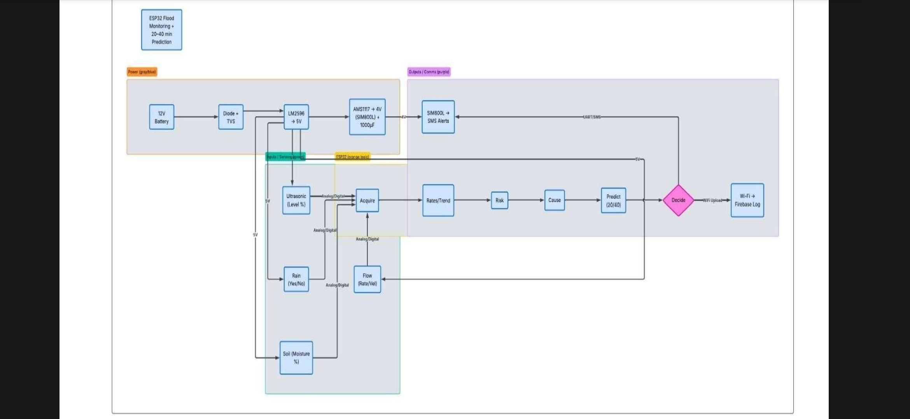
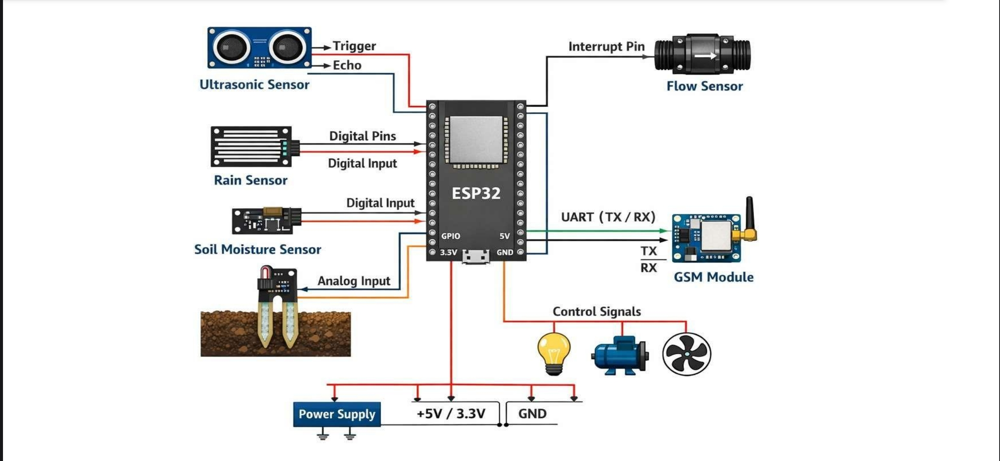

# Flood Monitoring and Cause Classification System

## Description
IoT based system to monitor water level in rivers/dams and classify flood causes using sensors and ML. Sends real-time alerts to authorities. Also predicts the flood 20 to 40 min early.

## Features
- Ultrasonic + Water level sensors for real-time monitoring
- ESP32 with GSM module for SMS alerts
- Rain sensor + Soil moisture sensor for cause detection
- Data logged to cloud (Firebase)
- Cause Classification: Heavy Rain, River Overflow, Drainage Blockage, Dam Release.

## Hardware Used
- ESP32 
- HC-SR04 Ultrasonic Sensor
- Water Level Sensor
- Rain Drop Sensor
- Soil Moisture Sensor
- GSM Module SIM800L
- Buzzer + LED for local alert

## Block Diagram

## Circuit Diagram

## Code
Check the `/code` folder for Arduino/ESP32 code

## Documentation
[Download Project Report PDF](docs/Floodmonitoring.pdf)
