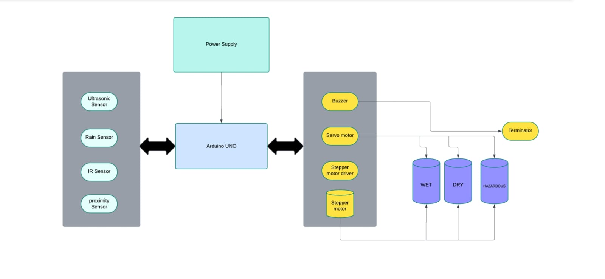
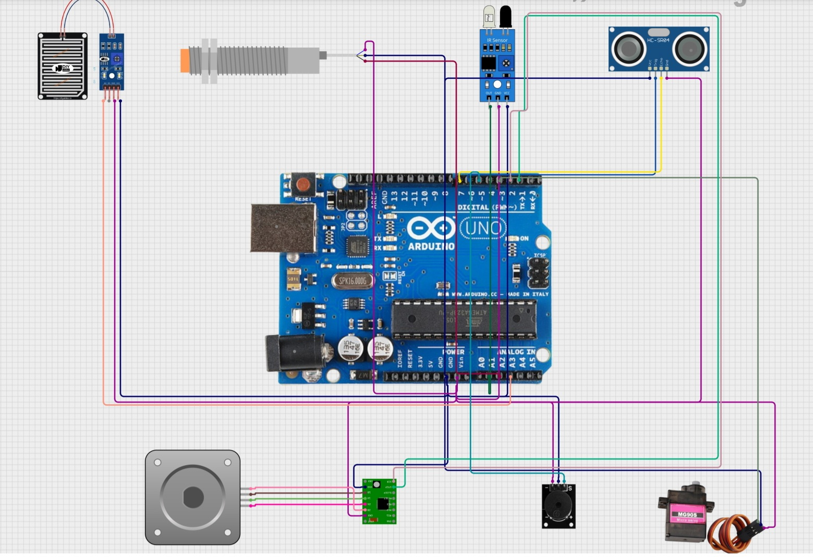

# Smart Waste Management System

## Description
Smart Dustbin that classifies Waste automatically, Helps in efficient waste collection.

## Features
- Moisture sensor to detect Wet waste
- Arduino UNO to process data
- IR sensor to detect object presence
- Inductive Proximity sensor to detect metal waste
- Ultrasonic Sensor to detect Waste level.
## Hardware Used
- Arduino Uno
- Stepper Motor for bin rotation mechanism for waste seggregation.
- Servo Motor for lid
- Sensors ( Ultrasonic, Inductive Proximity, IR, Moisture Sensor etc.)

## Block Diagram

## Circuit Diagram

## Code
Check the `/code` folder for Arduino code

## Documentation
[Download Project Report PDF](docs/wastemanagement.pdf)
